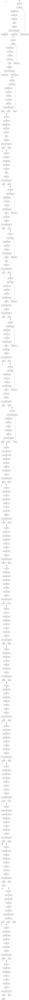

## 🔄 COMPONENTE 3: TRANSICIONES ENTRE DISTINTOS USUARIOS DEL BANCO

### 📊 Matriz de Transición de Estados y Comandos (CQRS)

El ciclo de vida del expediente crediticio se rige bajo la segregación de responsabilidades de comandos y consultas (CQRS). A continuación, se detalla la lógica de negocio que gobierna cada cambio de estado visible en el diagrama anterior:

| Estado Origen | Comando Ejecutado / Evento Gatillado | Perfil de Usuario | Validación de Regla de Negocio (Backend) | Estado Destino |
| :--- | :--- | :--- | :--- | :--- |
| **N/A** | `RegistrarClienteCommand` ➔ `ClienteRegistradoEvent` | Asesor de Crédito | Validación sintáctica de documento de identidad (mínimo 7 caracteres). Generación de hash único `CI-NIT + UUID`. | **BORRADOR** |
| **BORRADOR** | `CargarChecklistCommand` ➔ `ChecklistCompletadoEvent` | Asesor de Crédito | Verificación del cumplimiento de los 5 documentos mandatorios ASFI. Si falta alguno, `puedeAvanzar = false`. | **DOCUMENTACION_CONFORME** |
| **DOCUMENTACION_CONFORME** | `RegistrarBalancesCommand` ➔ `BalanceCuadradoEvent` | Asesor de Crédito | Restricción dura antidescuadre: Bloqueo del comando si la diferencia entre Activo y Pasivo + Patrimonio supera los $\pm10\text{ Bs}$.[cite: 3] | **BALANCE_VALIDADO** |
| **BALANCE_VALIDADO** | `EvaluarSectorProductivoCommand` ➔ `EvaluacionSectorialFinalizadaEvent` | Asesor de Crédito | - **Agrícola/Pecuaria:** Simulación de 1 a 24 ciclos.[cite: 3] - **Producción:** Validación de Margen de Utilidad Neta $\ge 10.0\%$. Si es menor, el estado transmuta directamente a **RECHAZADO**.[cite: 3] | **EVALUACION_COMPLETA** |
| **EVALUACION_COMPLETA** | `EnviarSolicitudComiteCommand` ➔ `SolicitudEnviadaComiteEvent` | Asesor de Crédito | Bloqueo de edición del expediente en la terminal del asesor de campo. Publicación de la solicitud en la bandeja del Back Office.[cite: 3] | **SOLICITUD_COMPLETA (En Comité)** |
| **SOLICITUD_COMPLETA** | `AprobarCreditoCommand` ➔ `CreditoAprobadoEvent` | Comité de Créditos | Verificación de firmas digitales y conformidad de alertas de riesgo (Semáforo). Preparación de datos para persistencia en Core.[cite: 3] | **APROBADO** |
| **SOLICITUD_COMPLETA** | `RechazarCreditoCommand` ➔ `CreditoRechazadoEvent` | Comité de Créditos | Registro del código de motivo de rechazo en el Event Store para fines de auditoría y reportes analíticos del TDR.[cite: 3] | **RECHAZADO** |

---

### 🛡️ Inmutabilidad y Pistas de Auditoría (Event Sourcing)

Cada una de las transiciones representadas en el diagrama `.svg` no sobrescribe los registros en la base de datos. En su lugar:
1. El comando invoca al agregado correspondiente (`ClienteAggregate`, `BalanceAggregate`, etc.), el cual ejecuta la validación financiera en el *Command-Side*.
2. Si la regla se cumple, el agregado aplica y persiste un **Evento Inmutable** en el Event Store (ej. `BalanceCuadradoEvent`).
3. El framework (Axon) estampa de forma automática e incambiable el **ID del usuario (Asesor/Comité)**, el **Timestamp exacto** y la **Dirección IP/Dispositivo**, cumpliendo de forma nativa con el requerimiento de contar con pistas y logs de auditoría exhaustivos exigidos en los requerimientos no funcionales del TDR[cite: 3].